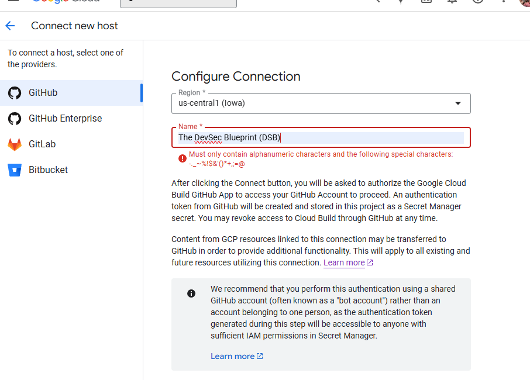
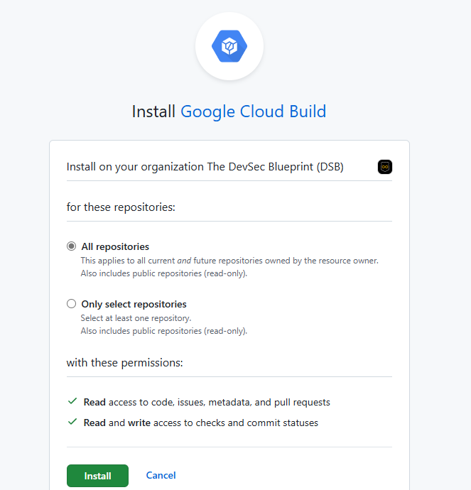
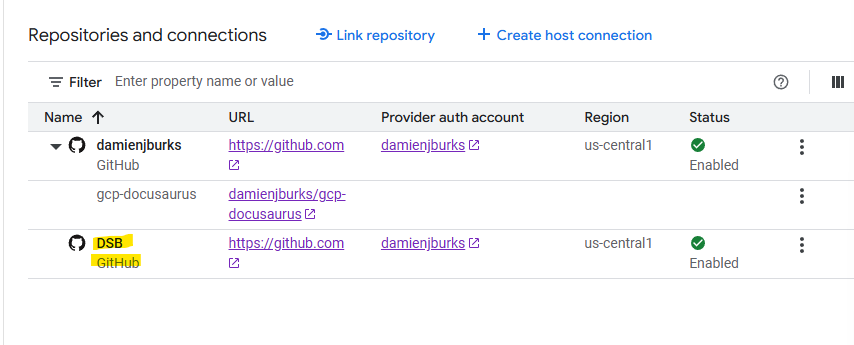

# GCP DevSecOps Home Lab

> **NOTE**: This project is a work in progress. Please standby.

## Steps:

- Log into Google Cloud, navigate to the Cloud Build dashboard, click on Repositories, and click on "Create a new host connection".

- Click GitHub and fill out the box below:

- If you are a new user, click "Install in a new account"

- Click your GitHub namespace or organization, and you're done with this. You should see it here in the repositories and connections:

